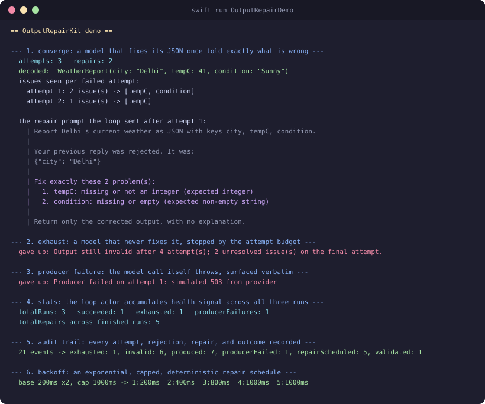
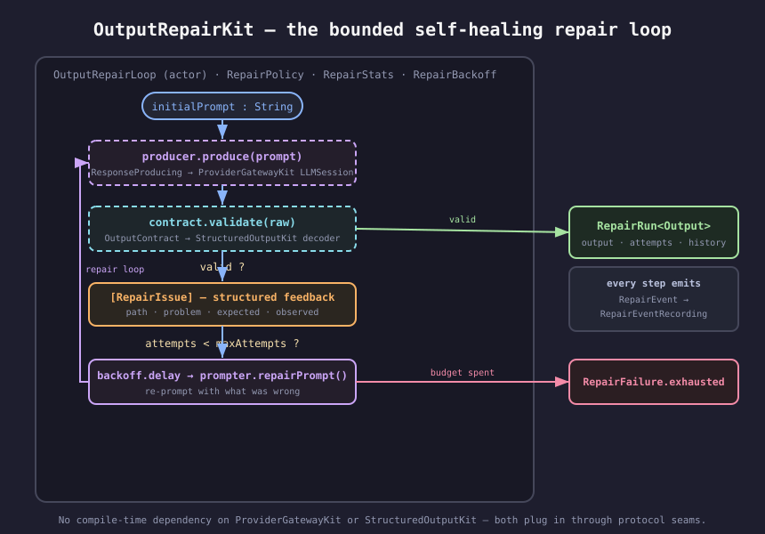
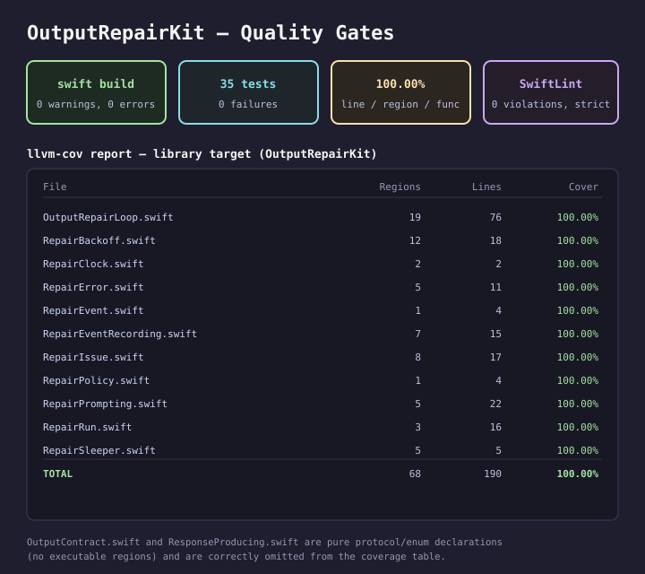

# OutputRepairKit

**A bounded, self-healing repair loop for structured LLM output in Swift — validate, feed the reasons back, re-prompt, and stop when it converges or the budget runs out.**

An actor-based, protocol-oriented Swift 6 package. It pairs with [ProviderGatewayKit](https://github.com/rajatslakhina/foundation-model-provider-gateway) (the model it re-prompts) and [StructuredOutputKit](https://github.com/rajatslakhina/structured-output-kit) (the schema it validates against), but depends on neither at compile time — both plug in through protocol seams.



## The problem

Ask a model for JSON and sometimes you get JSON. Other times you get a missing field, a number as a string, or a chatty preamble wrapped around the object. The naive fix — retry with the same prompt — throws away the one thing that would help: *what was wrong*. The 2026 applied-AI literature is consistent on this (Pydantic AI's output-validator retries, Instructor's `max_retries`, the VeriHarness "validator-controlled loop", the "Is Three the Magic Number?" repair-loop study): a repair loop converges when you send back **structured feedback** — the failure's location, what was observed, and what was expected — not a bare "try again". And it has to be **bounded**: a model that has not produced valid output in a few feedback rounds rarely does on the tenth, and the tokens are not free.

`OutputRepairKit` is that loop, factored out as a reusable component:

- **Produce → validate → feed back → back off → repeat → stop.** One small actor orchestrates the cycle; you supply the model and the schema.
- **Structured feedback, not "try again".** Each rejection is a list of `RepairIssue`s (`path · problem · expected · observed`) that the default prompter turns into a numbered correction prompt.
- **A hard attempt budget.** `RepairPolicy` caps the number of producer calls; the loop stops with `RepairFailure.exhausted` rather than spinning.
- **Exponential, capped, deterministic backoff.** `RepairBackoff` is expressed in whole milliseconds with an integer multiplier — exact, no jitter, testable.
- **An auditable trace.** Every attempt, rejection, repair, and terminal outcome is emitted as a `RepairEvent`; the loop actor also accumulates `RepairStats` across runs.

## Architecture



The loop owns no model and no schema of its own — both are seams:

| Seam | Protocol | Production conformer |
|------|----------|----------------------|
| Get raw output for a prompt | `ResponseProducing` | wraps `ProviderGatewayKit`'s `LLMSession.send(...)` |
| Decide if output is valid, and why not | `OutputContract` | wraps a `StructuredOutputKit` schema decoder |
| Compose the correction prompt | `RepairPrompting` | `DefaultRepairPrompter` (or your own) |
| Wait between attempts | `RepairSleeper` | `SystemRepairSleeper` |
| Stamp / record events | `RepairClock`, `RepairEventRecording` | `SystemRepairClock`, `InMemoryRepairEventRecorder` |

Because these are protocols, the package has **zero third-party dependencies** and stays fully testable offline — the same no-compile-time-dependency convention every kit in this ecosystem follows.

## Install

```swift
// Package.swift
.package(url: "https://github.com/rajatslakhina/output-repair-kit.git", from: "1.0.0")
```

```swift
.target(name: "YourApp", dependencies: [
    .product(name: "OutputRepairKit", package: "output-repair-kit")
])
```

## Usage

**1. Describe what a valid output is, and why one is not** — this is where a `StructuredOutputKit` decoder would live in production:

```swift
import OutputRepairKit

struct WeatherReport: Codable, Sendable { let city: String; let tempC: Int; let condition: String }

struct WeatherContract: OutputContract {
    func validate(_ raw: String) -> ContractResult<WeatherReport> {
        guard let data = raw.data(using: .utf8),
              let dict = (try? JSONSerialization.jsonObject(with: data)) as? [String: Any] else {
            return .invalid([RepairIssue(path: "", problem: "not a JSON object", observed: raw)])
        }
        var issues: [RepairIssue] = []
        if !(dict["city"] is String) {
            issues.append(RepairIssue(path: "city", problem: "missing or not a string", expected: "string"))
        }
        guard let city = dict["city"] as? String, let temp = dict["tempC"] as? Int,
              let condition = dict["condition"] as? String, issues.isEmpty else {
            return .invalid(issues)   // collect every problem in one pass
        }
        return .valid(WeatherReport(city: city, tempC: temp, condition: condition))
    }
}
```

**2. Wrap your model as a producer** — in production this calls a routed `ProviderGatewayKit` session:

```swift
struct SessionProducer: ResponseProducing {
    let session: MyRoutedLLMSession
    func produce(prompt: String) async throws -> String {
        try await session.send(prompt)
    }
}
```

**3. Run the loop:**

```swift
let loop = OutputRepairLoop(
    contract: WeatherContract(),
    policy: RepairPolicy(maxAttempts: 3, backoff: RepairBackoff(baseMilliseconds: 200, multiplier: 2, capMilliseconds: 1000)),
    recorder: InMemoryRepairEventRecorder()
)

do {
    let run = try await loop.run(initialPrompt: "Report Delhi's weather as JSON.", producer: SessionProducer(session: session))
    print(run.output)                     // WeatherReport(city: "Delhi", tempC: 41, condition: "Sunny")
    print("took \(run.attempts) attempts, \(run.repairs) repairs")
} catch let RepairFailure.exhausted(attempts, history, _) {
    print("gave up after \(attempts); last issues: \(history.last ?? [])")
}
```

When the first reply is `{"city": "Delhi"}`, the loop sends back:

```
Report Delhi's weather as JSON.

Your previous reply was rejected. It was:
{"city": "Delhi"}

Fix exactly these 2 problem(s):
  1. tempC: missing or not an integer (expected integer)
  2. condition: missing or empty (expected non-empty string)

Return only the corrected output, with no explanation.
```

Run the bundled demo end to end:

```bash
swift run OutputRepairDemo
```

## Quality gates



- `swift build` — 0 warnings, 0 errors.
- `swift test --enable-code-coverage` — 35 tests, 0 failures.
- `llvm-cov report` — **100.00%** line, region, and function coverage on every library file with executable regions. (`OutputContract.swift` and `ResponseProducing.swift` are pure protocol/enum declarations with no executable regions, so they carry no coverage rows.)
- `swiftlint lint --strict` — 0 violations (SwiftLint 0.63.2).

## Where it sits in the ecosystem

This is one kit in a family built around `ProviderGatewayKit`. Each covers a distinct axis of a production LLM integration:

- **`ProviderGatewayKit`** routes a request across providers by capability. **`OutputRepairKit`** re-prompts whichever provider it routed to until the output is valid.
- **`StructuredOutputKit`** decodes and validates one reply. **`OutputRepairKit`** is the loop *around* that validation — the part that acts on a rejection instead of just returning it.
- **`GuardrailKit`** screens a reply against a content policy; **`OutputRepairKit`** repairs a reply against a structural contract. Different question, complementary place in the pipeline.

## License

MIT
